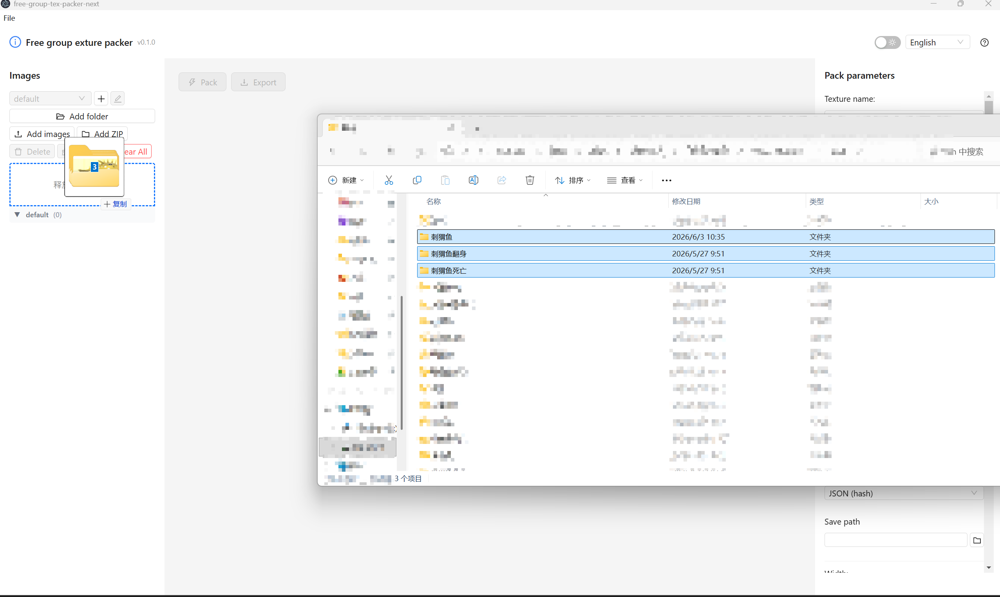
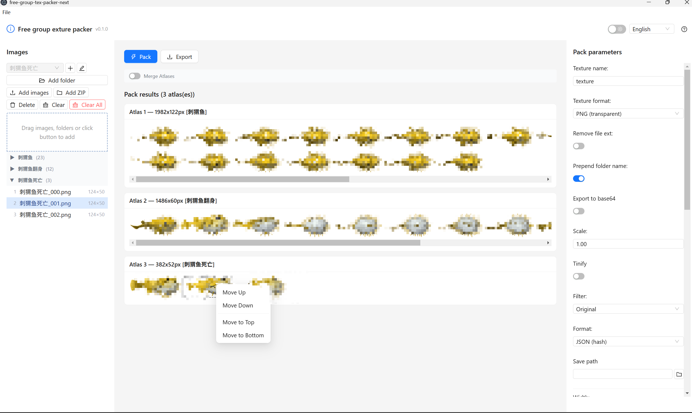
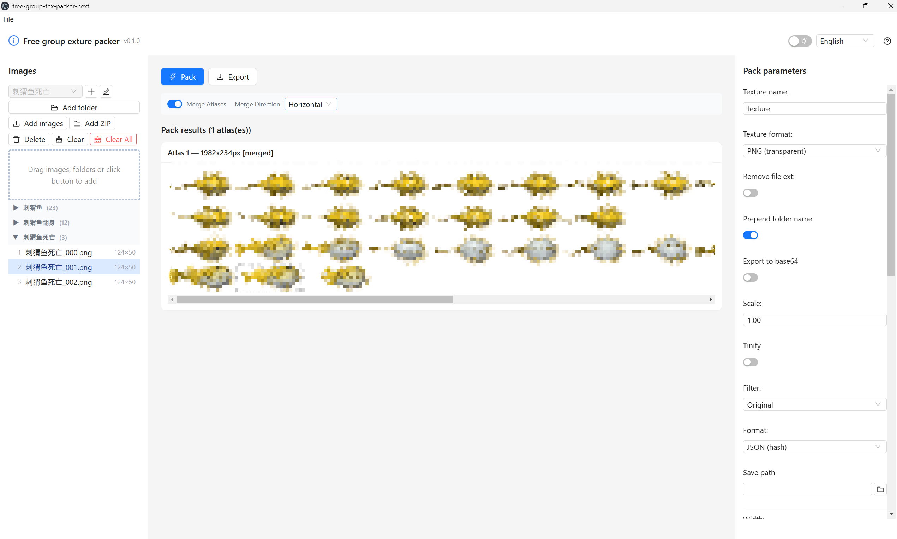

# Free Group Texture Packer

精灵表 / 纹理图集打包工具。将零散图片打包成一张大图集，同时生成元数据文件，适用于游戏和网站开发。

基于 [odrick/free-tex-packer](https://github.com/odrick/free-tex-packer) 重写，技术栈：**React 19 + Vite 8 + TypeScript 6 + Ant Design 5 + Tailwind 3 + Zustand 5 + Electron**。

## 功能亮点

- **多种打包算法**：MaxRects（5 种策略）、简单行列排列、最优模式（穷举所有组合）
- **18 种导出格式**：JSON（hash/array）、XML、CSS、Pixi.js、Phaser（2/3）、Spine、Cocos2d、Starling、Unity3D、UnrealEngine、Godot、UIKit、Egret2D
- **图片分组**：可按组打包，每组生成独立图集
- **图片滤镜**：灰度、遮罩、TinyPNG 压缩（仅 Electron 版）
- **自动裁剪**：自动去除透明边框，节省空间
- **暗色模式**：内置暗色主题

## 截图预览

| 批量导入 | 分组打包 | 分组合并 |
|---|---|---|
|  |  |  |

## 快速开始

```bash
# Web 开发模式
pnpm dev

# Electron 开发模式
pnpm dev:electron

# 生产构建
pnpm build              # Web 构建
pnpm build:electron     # Electron 安装包
```

## 使用方法

1. 浏览器打开 `pnpm dev` 或运行桌面应用
2. 拖拽图片或使用文件选择器添加图片
3. 配置打包参数（算法、间距、裁剪等）
4. 点击 **打包** 生成图集
5. 选择导出格式并下载

## 技术栈


| 层面     | 选型                                |
| -------- | ----------------------------------- |
| 框架     | React 19                            |
| 桌面     | Electron 35                         |
| 语言     | TypeScript 6                        |
| UI 库    | Ant Design 5                        |
| 样式     | Tailwind 3                          |
| 状态管理 | Zustand 5                           |
| 构建     | Vite 8                              |
| 装箱算法 | maxrects-packer、自实现 MaxRectsBin |

## 项目结构

```
src/
  app/          — 类型定义、Zustand 状态、国际化
  core/         — 核心打包引擎（PackProcessor、packers、Rect、Trimmer）
  features/     — 图片管理、打包参数、结果预览、导出、滤镜
  platform/     — Web / Electron 平台抽象层
  components/   — 通用 UI 组件
  utils/        — 工具函数
electron/
  main.ts       — Electron 主进程
  preload.cjs   — 预加载脚本（contextBridge）
```

## 导出格式

目前 JSON (hash) 和 JSON (array) 有完整的 TypeScript 渲染器，其余格式会自动回退到 JSON (hash)。

## 仓库地址

- GitHub：https://github.com/kittlen/free-group-exture-packer
- Gitee：https://gitee.com/kittlen/free-group-exture-packer

## 许可证

MIT
